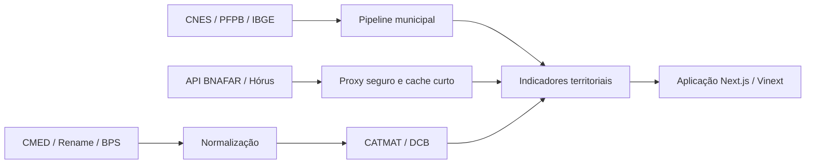

# Fármaco Brasil

[](https://github.com/pedropaulofernandes88-stack/farmaco-brasil/actions/workflows/ci.yml)
[](LICENSE)
[](CHANGELOG.md)
[](docs/DATA_SOURCES.md)

Mapa acadêmico e auditável de medicamentos, compras públicas, oferta normativa no SUS, rede de acesso e posições informadas de estoque no Brasil.

**[Abrir demonstração](https://farmaco-brasil.pedropaulofernandes8.chatgpt.site/)** · [Metodologia](docs/METHODOLOGY.md) · [Fontes](docs/DATA_SOURCES.md) · [Limitações](docs/LIMITATIONS.md)


> Protótipo acadêmico para inteligência de dados e formulação de perguntas de pesquisa. Não oferece orientação médica, não recomenda tratamentos e não substitui profissionais ou serviços de saúde.

## O que a ferramenta entrega

- consulta dos medicamentos de maior comercialização divulgados pela CMED e cruzamento com a Rename;
- indicadores do Banco de Preços em Saúde para cinco apresentações comparáveis;
- camada de acesso para 5.571 registros territoriais, com população, CNES tipo 43 e cobertura observada do Farmácia Popular;
- taxa de farmácias cadastradas por 10 mil habitantes;
- identificação exploratória de vazios de cobertura observada;
- comparação lado a lado entre municípios;
- consulta ao vivo de posições declaradas no Hórus/BNAFAR para cinco códigos CATMAT;
- catálogo de fontes, evidências PubMed e limitações junto aos indicadores.

Medicamentos atualmente vinculados entre BPS, CATMAT e consulta BNAFAR:

| Medicamento | Apresentação | CATMAT com unidade |
|---|---|---|
| Losartana potássica | 50 mg, comprimido | `BR0268856U0042` |
| Dipirona sódica | 500 mg, comprimido | `BR0267203U0042` |
| Metformina | 500 mg, comprimido | `BR0267690U0042` |
| Hidroclorotiazida | 25 mg, comprimido | `BR0267674U0042` |
| Sinvastatina | 20 mg, comprimido | `BR0267747U0042` |

## Perguntas que o projeto ajuda a investigar

- Os medicamentos de maior comercialização também estão contemplados na Rename?
- Como varia a presença de farmácias cadastradas no CNES em relação à população?
- Quais municípios merecem investigação por ausência de cobertura PFPB observada?
- Quanto variam os preços unitários registrados no BPS?
- Há posição BNAFAR/Hórus recente para um CATMAT em determinado município?
- Onde a evidência disponível termina e começa uma lacuna de dados?

## Interpretação responsável

Os indicadores têm significados diferentes e não devem ser tratados como equivalentes:

- cadastro CNES ativo não confirma vínculo com o SUS, funcionamento ou dispensação;
- cobertura observada do Farmácia Popular não confirma estoque;
- presença na Rename é normativa e não confirma disponibilidade local;
- posição BNAFAR/Hórus é declarada e datada, não estoque em tempo real;
- ausência de registro BNAFAR não significa estoque zero;
- distância calculada entre centroides é geodésica e não equivale a rota ou tempo rodoviário;
- “mais vendido” segue a métrica, faixa e granularidade publicadas pela CMED, não representa pacientes ou prescrições.

Leia todas as ressalvas em [Limitações](docs/LIMITATIONS.md).

## Arquitetura



A aplicação usa Next.js, React e TypeScript. A camada municipal está versionada como dado derivado compacto. A rota do servidor limita os CATMAT aceitos, consulta a API oficial e devolve somente campos necessários, sem endereço, telefone, e-mail ou lote. Veja [Arquitetura](docs/ARCHITECTURE.md).

## Execução local

Requisitos:

- Node.js 22.13 ou superior;
- npm;
- Python 3.11 ou superior para validação e reconstrução de dados;
- para reconstrução: `numpy` e `openpyxl`.

```bash
git clone https://github.com/pedropaulofernandes88-stack/farmaco-brasil.git
cd farmaco-brasil
npm ci
npm run dev
```

A aplicação ficará disponível em `http://localhost:3000`.

Verificação completa:

```bash
npm run check
```

Reconstrução opcional da camada municipal:

```bash
python -m pip install numpy openpyxl
python scripts/build_access_data.py
python scripts/validate_access_data.py
```

Os arquivos brutos são baixados para `data/raw/`, diretório deliberadamente ignorado pelo Git. URLs, datas, tamanhos e hashes ficam registrados em `data/access-manifest.json`.

## API municipal de posição BNAFAR

```http
GET /api/bnafar?municipality=355030&catmat=BR0268856U0042
```

Parâmetros:

- `municipality`: código IBGE de seis dígitos usado pela fonte;
- `catmat`: um dos códigos previamente validados e permitidos pela aplicação.

Resposta resumida:

```json
{
  "municipality": "SAO PAULO",
  "product": "LOSARTANA POTÁSSICA 50 MG COMPRIMIDO",
  "catmat": "BR0268856U0042",
  "latestDate": "AAAA-MM-DD",
  "records": 5,
  "facilities": 1,
  "totalQuantity": 1470,
  "zeroRecords": 0,
  "truncated": false,
  "entries": []
}
```

O exemplo demonstra o contrato, não um valor permanente. A quantidade muda conforme a fonte. A API aplica cache público curto e nunca deve ser usada como confirmação de disponibilidade para retirada.

## Estrutura

```text
app/                  aplicação e rota BNAFAR
app/data/             camada municipal derivada
data/                 manifestos e metadados
docs/                 método, arquitetura e governança
public/               ativos públicos
scripts/              ingestão e validação
.github/               CI e modelos de colaboração
```

## Fontes e reprodutibilidade

As fontes incluem Anvisa/CMED, Rename, BPS, BNAFAR/Hórus, CNES, Farmácia Popular, SIDRA e Malhas do IBGE. O [catálogo de fontes](docs/DATA_SOURCES.md) registra origem, granularidade, referência temporal e limitações. O [dicionário](docs/DATA_DICTIONARY.md) descreve os campos publicados.

Os dados de terceiros permanecem sujeitos às condições, licenças e políticas dos respectivos órgãos. A licença MIT deste repositório cobre o código original, não transfere propriedade nem relicencia bases oficiais.

## Colaboração

O repositório é mantido exclusivamente por Pedro Paulo Fernandes. Terceiros não recebem permissão direta de escrita. Issues e pull requests são tratados como sugestões e somente o mantenedor decide sobre revisão, adaptação e incorporação. Consulte [CONTRIBUTING.md](CONTRIBUTING.md).

## Roadmap

- integrar área e densidade municipal oficiais;
- incorporar cobertura municipal do BPS por CATMAT;
- avaliar rotas rodoviárias reproduzíveis;
- criar inventário versionado de REMUME;
- medir cobertura, atraso e completude da BNAFAR;
- incorporar vulnerabilidade social e carga de doença;
- produzir séries temporais e validação externa.

Detalhamento em [Roadmap](docs/ROADMAP.md).

## Citação

Use os metadados de [CITATION.cff](CITATION.cff). Forma sugerida:

> Fernandes, Pedro Paulo. *Fármaco Brasil: inteligência farmacêutica territorial*. Versão 0.4.0, 2026. https://github.com/pedropaulofernandes88-stack/farmaco-brasil

## Licença

Código original sob [Licença MIT](LICENSE). Dados e documentos de terceiros mantêm seus termos de origem.
