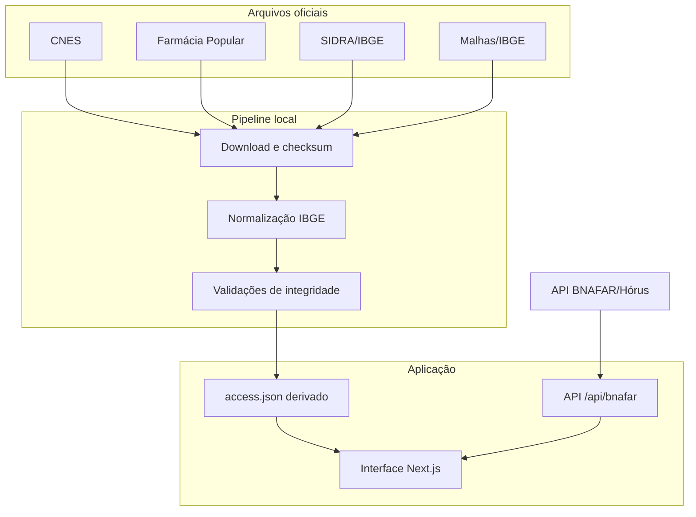

# Arquitetura

## Visão geral

O Fármaco Brasil separa dados estáticos reprodutíveis de consultas públicas que precisam ser feitas em tempo de uso.

## Componentes

### Aplicação web

- Next.js, React e TypeScript;
- build com Vinext para execução compatível com Cloudflare Workers;
- dados municipais compactos importados no cliente;
- navegação por UF e município sem banco de dados próprio.

### Pipeline municipal

`scripts/build_access_data.py`:

1. baixa as fontes oficiais para `data/raw/`;
2. calcula SHA-256 e tamanho de cada arquivo;
3. normaliza códigos e nomes territoriais;
4. seleciona estabelecimentos CNES ativos do tipo 43;
5. aplica a regra documentada de cobertura PFPB observada;
6. calcula taxas populacionais e distâncias geodésicas;
7. publica `app/data/access.json` e `data/access-manifest.json`.

`scripts/validate_access_data.py` verifica unicidade, domínios, totais e invariantes do conjunto publicado.

### Consulta BNAFAR

`GET /api/bnafar` funciona como adaptador seguro para a API oficial:

- aceita códigos IBGE municipais de seis dígitos;
- aceita apenas cinco CATMAT previamente validados;
- limita a resposta de origem a 1.000 registros;
- seleciona a data mais recente presente na resposta;
- agrega quantidades por CNES;
- devolve somente nome do produto, data, quantidade, CNES, estabelecimento e sistema de origem;
- não retransmite endereço, telefone, e-mail, lote ou validade;
- aplica cache curto;
- sinaliza quando o limite da fonte é atingido.

A rota não transforma posição declarada em estoque disponível e não classifica ausência de registro como ruptura.

## Chaves de integração

| Domínio | Chave | Uso |
|---|---|---|
| Território | código IBGE de 7 dígitos | camada municipal estática |
| Consulta BNAFAR | código IBGE de 6 dígitos | parâmetro exigido pela API de origem |
| Estabelecimento | CNES | agregação da posição informada |
| Medicamento | CATMAT com unidade | comparação entre BPS e BNAFAR |
| Nomenclatura | DCB/descrição CATMAT | interpretação farmacêutica |

## Segurança e privacidade

- não há autenticação ou segredo necessário para as fontes integradas;
- nenhuma chave de API é enviada ao navegador;
- parâmetros da rota são validados por lista permitida;
- dados de contato e lote da resposta de origem são descartados;
- a aplicação publica somente dados administrativos públicos e agregados;
- workflows externos têm permissão de leitura do repositório.

## Decisões conhecidas

- os dados municipais derivados são versionados para permitir revisão e funcionamento determinístico;
- arquivos brutos permanecem fora do Git devido a tamanho, atualização e condições da fonte;
- a reconstrução de dados não roda a cada pull request porque depende de serviços externos e produziria testes não determinísticos;
- a CI valida o artefato derivado existente, enquanto atualizações de dados são executadas e revisadas separadamente.
